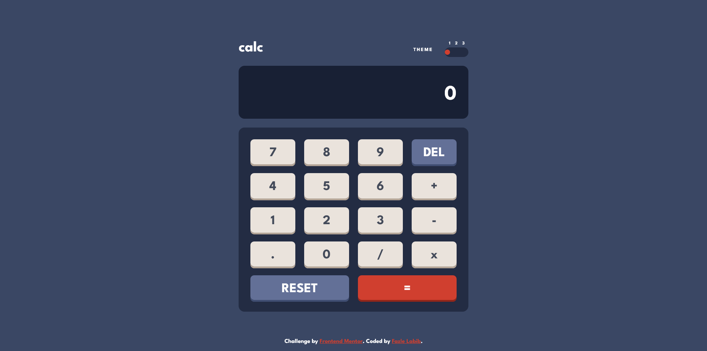

# Frontend Mentor - Calculator app solution

This is a solution to the [Calculator app challenge on Frontend Mentor](https://www.frontendmentor.io/challenges/calculator-app-9lteq5N29). Frontend Mentor challenges help you improve your coding skills by building realistic projects. 

## Table of contents

- [Overview](#overview)
  - [The challenge](#the-challenge)
  - [Screenshot](#screenshot)
  - [Links](#links)
- [My process](#my-process)
  - [Built with](#built-with)
  - [What I learned](#what-i-learned)
  - [Useful resources](#useful-resources)
- [Author](#author)

## Overview

### The challenge

Users should be able to:

- See the size of the elements adjust based on their device's screen size
- Perform mathmatical operations like addition, subtraction, multiplication, and division
- Adjust the color theme based on their preference
- **Bonus**: Have their initial theme preference checked using `prefers-color-scheme` and have any additional changes saved in the browser

### Screenshot




### Links

- Solution URL: [Add solution URL here](https://github.com/FazleLabib/frontend-mentor-calculator-app)
- Live Site URL: [Add live site URL here](https://fazlelabib.github.io/frontend-mentor-calculator-app)

## My process

### Built with

- Semantic HTML5 markup
- CSS custom properties
- Flexbox
- CSS Grid
- Vanilla JavaScript

### What I learned

Learned the shunting yard algorithm and was able to implement it to make the calculator functional.

<!-- ```html
<h1>Some HTML code I'm proud of</h1>
```
```css
.proud-of-this-css {
  color: papayawhip;
}
```
```js
const proudOfThisFunc = () => {
  console.log('🎉')
}
``` -->

### Useful resources

- [Shunting Yard Algorithm](https://www.youtube.com/watch?v=Wz85Hiwi5MY) - This helped me understand the shunting yard algorithm.
- [Post Fix Stack Evaluator](https://www.youtube.com/watch?v=bebqXO8H4eA) - This helped me understand the post fix stack evaluator algorithm.

## Author

- Frontend Mentor - [@yFazleLabib](https://www.frontendmentor.io/profile/FazleLabib)
